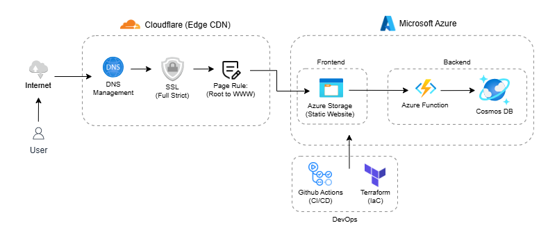

# cloud-resume-challenge-azure

A full-stack, serverless resume website built as part of the Cloud Resume Challenge. This project showcases a secure, high-performance architecture using Microsoft Azure for core services and Cloudflare for edge-level optimizations.

Live Demo Link: https://wisdomresume.site

*Figure 1.1: The end-to-end serverless architecture for wisdomresume.site.*

## Architecture Overview
The project implements a modern, decoupled architecture focusing on high availability and low cost.
Traffic Flow:
- User requests wisdomresume.site.
- Cloudflare (Edge) intercepts the request, handles the SSL Handshake (Full Mode), and executes a 301 Redirect from root to www.
- Azure Storage serves the static HTML/CSS/JS files from the $web container.
- JavaScript (Frontend) fetches the visitor count from an Azure Function API.
Azure Function updates/retrieves data from Cosmos DB

## Tech Stack

- Frontend: HTML5, CSS3, Vanilla JavaScript
- Cloud Hosting: Azure Blob Storage (Static Website Hosting)
- Domain Registrar: Namecheap.
- Edge & CDN: Cloudflare (DNS, CDN, SSL, Edge Redirects)
- Serverless API: Azure Function (Python)
- Database: Azure Cosmos DB (NoSQL/Table API for Visitor Counter)
- CI/CD: GitHub Actions
- Infrastructure as Code: Terraform

## Key Implementation Details

### 1. Strategic Architecture Choice: Cloudflare vs. Azure Front Door

<b>Challenge:</b> While implementing the <b>HTTPS</b> and <b>CDN</b> requirements, I encountered a shift in the Azure ecosystem: Azure CDN (Classic) is being retired, and new resources must now use Azure Front Door Standard. Unlike the consumption-based pricing of the original CDN, Front Door requires a minimum monthly base fee of around $35, which is inefficient for a personal portfolio project.

<b>Solution:</b> Integrated Cloudflare as a free-tier CDN alternative. This required manual DNS record management and "Indirect CNAME Validation" via asverify records to bypass Azure's default verification logic.

<b>Result:</b> Achieved identical performance and security requirements (Global CDN, SSL, Custom Domain) at $0 monthly operational cost.

### 2. DNS & SSL Handshake Logic
Integrating Azure Storage with Cloudflare required manual handshake configurations that bypass standard automated workflows:

<b>Indirect Verification:</b> Implemented <b>asverify</b> CNAME records (unproxied) to satisfy Azure’s domain ownership checks while keeping the live traffic records proxied behind Cloudflare’s WAF.

<b>SSL Full (Strict):</b> Configured Cloudflare to enforce a secure tunnel to the Azure origin. This ensures end-to-end encryption by validating Azure’s certificate before serving traffic to wisdomresume.site.

### 3. Edge-Level Redirection

To ensure SEO consolidation and a consistent user experience, I implemented Cloudflare Page Rules to handle 301 Permanent Redirects from the root domain (wisdomresume.site) to the www subdomain. This offloads the redirect logic from the application layer to the network edge, reducing latency.

## Project Progress Log

#### Phase 1: Infrastructure & Frontend (Completed)

- Developed responsive HTML/CSS resume.
- Deployed to Azure Storage Static Website container.
- Configured Namecheap custom domain with Cloudflare Nameservers.
- Configured A and CNAME records to route traffic accurately.
- Verified and Added Custom Domain on Azure Networking Dashboard
- Resolved SSL/TLS handshake for custom domain via Cloudflare Proxy.
- Implemented Root-to-WWW redirection at the Edge.

#### Phase 2: Database & Serverless API (Completed)

- Provision Azure Cosmos DB (Table API) for visitor tracking.
- Develop Azure Function in Python to handle DB increments.
- Implement Frontend JavaScript code to fetch and display the live visitor count.

#### Phase 3: Automation (CI/CD) & IaC (Current)

- Author Terraform scripts to make the infrastructure reproducible.
- Build GitHub Actions pipeline for automated frontend / API deployment.
- Implement Cloudflare Cache Purge logic within the CI/CD workflow.

## Detailed Technical Write-up

Building this project involved navigating specific challenges with Azure-to-Cloudflare integration and SSL handshakes. I have documented the entire journey—including the "Why" behind my architectural decisions—in a comprehensive blog post.

Read the full implementation story on Medium <b> (coming soon..)</b>